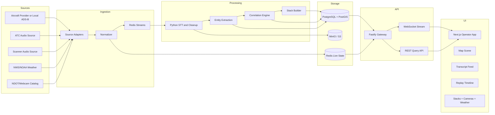

# System Overview

```mermaid
flowchart LR
    subgraph Sources
      A[Aircraft Provider or Local ADS-B]
      B[ATC Audio Source]
      C[Scanner Audio Source]
      D[NWS/NOAA Weather]
      E[NDOT/Webcam Catalog]
    end

    subgraph Ingestion
      I1[Source Adapters]
      I2[Normalizer]
      I3[Redis Streams]
    end

    subgraph Processing
      P1[Python STT and Cleanup]
      P2[Entity Extraction]
      P3[Correlation Engine]
      P4[Stack Builder]
    end

    subgraph Storage
      S1[(PostgreSQL + PostGIS)]
      S2[(Redis Live State)]
      S3[(MinIO / S3)]
    end

    subgraph API
      G1[Fastify Gateway]
      G2[WebSocket Stream]
      G3[REST Query API]
    end

    subgraph UI
      U1[Next.js Operator App]
      U2[Map Scene]
      U3[Transcript Feed]
      U4[Replay Timeline]
      U5[Stacks + Cameras + Weather]
    end

    A --> I1
    B --> I1
    C --> I1
    D --> I1
    E --> I1
    I1 --> I2 --> I3
    I3 --> P1 --> P2 --> P3 --> P4
    I2 --> S2
    P1 --> S3
    P2 --> S1
    P3 --> S1
    P4 --> S1
    S1 --> G1
    S2 --> G1
    G1 --> G2
    G1 --> G3
    G2 --> U1
    G3 --> U1
```
